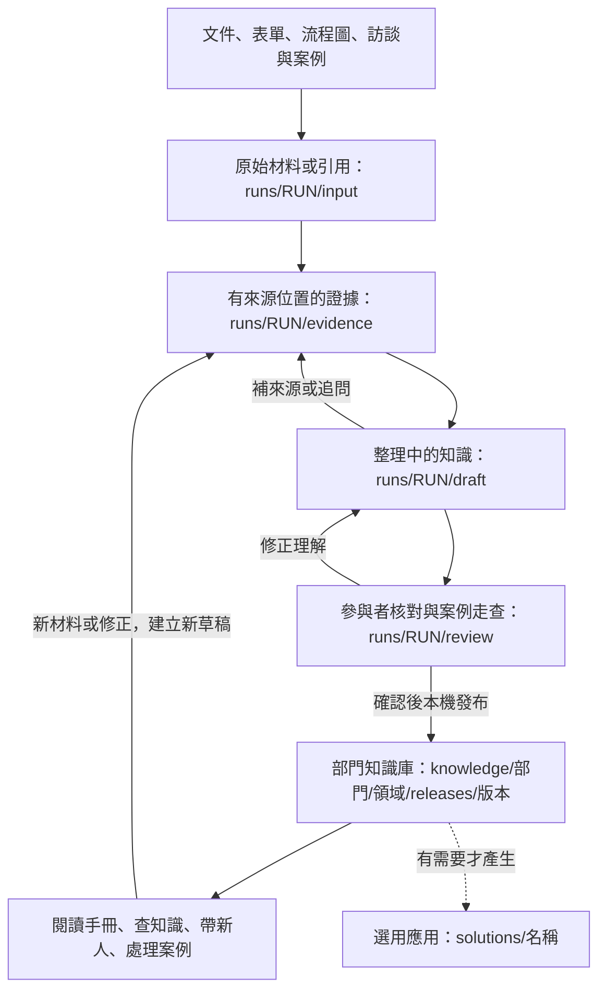

# 部門知識蒸餾工作坊

透過文件、訪談、案例與操作觀察，保存**部門重要的業務知識**：關鍵規則、判斷線索與理由、例外、交接要求，以及資深員工的經驗與適用邊界。主要成果是可閱讀、可追溯、可更新的部門知識庫。

這是一個由 **Codex 帶領、使用者用自然語言參與**的 MVP。你提供業務經驗、材料並修正與確認理解；Codex 整理證據、維護檔案及執行檢查。知識庫發布後就能完成一次蒸餾。需要時，才把其中的知識封裝成 Skill、SOP 或其他使用形式。

這裡有兩種不同用途的 Skill：`.agents/skills/` 是**執行蒸餾的方法指令**；`solutions/` 裡生成的 Skill 是**部門知識的選用應用**。生成幾個 Skill 不作為蒸餾完成指標。

## MVP 要完成什麼

一次先處理一個有清楚邊界的部門任務。選擇依據是錯誤的業務影響、判斷難度、知識是否集中在少數人，以及誰需要接手使用；材料可得性用來安排先後。

| 最終要回答的問題 | 看哪裡 |
| --- | --- |
| 這份知識為何重要，支援誰完成什麼任務？ | 工作範圍摘要、手冊的情境與任務 |
| 看哪些線索、如何判斷、為什麼、何時例外？ | `handbook.md` 的規則、判斷、經驗與交接 |
| 根據什麼來源，誰確認，哪些案例走查過？ | 手冊的來源與確認紀錄 |
| 哪些已確認、哪些未知、哪些不在本次範圍？ | `coverage.md`、手冊範圍與缺口 |

**完成一次蒸餾的條件**：範圍與用途清楚、重要知識有來源、參與者確認目前版本、核心知識通過案例走查、限制明列，並建立 Knowledge Release（已確認範圍的知識版本）。一次 Release 不代表整個部門知識已蒸餾完畢。

## 先看資料怎麼流



Codex 在流程中閱讀、追問與建模；Python 工具負責檔案格式、引用、渲染與發布檢查。各 Skill 是同一工作流程中的方法分工，不是十個自動並行的 Agent。

| 你參與的步驟 | 輸入 → 輸出 | 你要做什麼 |
| --- | --- | --- |
| 1. 界定範圍 | 部門目的、候選任務、現有材料 → `engagement.yaml`、情境草稿 | 確認哪個任務重要、誰會使用 |
| 2. 擷取與整理 | 原始材料／訪談 → 證據 → `draft/` 模型與手冊草稿 | 補充具體事件、線索、理由及例外 |
| 3. 核對與案例走查 | 草稿＋來源＋案例 → 修正、缺口、確認紀錄 | 核對理解，用案例檢查判斷 |
| 4. 發布與使用 | 已確認草稿 → `knowledge/` 的 Release、手冊、涵蓋說明 | 閱讀、使用並提供修正 |

步驟 2 可邊訪談邊建模；步驟 3 發現缺口就回去補。每次交接由 Codex 說明「讀了什麼、寫到哪裡、還缺什麼、下一步做什麼」，並更新 `state.yaml` 供中斷續作。逐階段的 INPUT／OUTPUT、檔案格式與完成條件見 [MVP 開發規格書](docs/development-spec.md)；完整流向見 [架構說明](docs/architecture.md#各階段的-data-flow)。

## 怎麼開始

在 Codex 開啟本 repository，使用 **`$bu-knowledge-workflow`**。沒有材料就從訪談開始；有任意材料就一起盤點，再補訪談。文件、表單、流程圖與訪談紀錄可同時提供。

沒有現成材料：

> 使用 $bu-knowledge-workflow。我想整理「＿＿部門的＿＿工作」。請先界定重要知識的範圍，再從實際案例訪談，整理判斷理由、例外與交接；這次產出部門知識庫。

已有材料：

> 使用 $bu-knowledge-workflow。我想整理「＿＿工作」，已有「＿＿文件、表單、流程圖、訪談筆記等」。請一起盤點、交叉核對，找出重要知識與缺口，再針對缺口訪談，產出部門知識庫。

接續既有工作：

> 請繼續 runs 裡的「＿＿RUN」，先讀 state.yaml，說明目前成果與下一步。

也可以從某位資深同事的經驗切入，Codex 會保留專家歸屬並連回部門任務。`department-first`／`expert-first` 只表示切入視角，不影響材料類型，也不用你先選技術模式或寫 PRD。

表單能顯示欄位，流程圖能顯示分支，但兩者未必說明判斷理由。Codex 會保留未知與衝突，不自行把欄位或箭頭補成業務規則。`.drawio` 有現成解析工具；其他材料依可用工具閱讀。

若環境出現同名 Skill，請指定「使用這個 repository 的 `.agents/skills/bu-knowledge-workflow/SKILL.md`」。第一次使用可請 Codex「依 README 建立 Python 環境並執行 check-repo」。

## 方法論為什麼適合

| 設計問題 | 依據與採用方式 |
| --- | --- |
| 先保存哪些重要知識？ | **APQC** 的知識盤點與轉移優先序：連到業務影響、持有人與使用者，在 frame 選定範圍 |
| 怎麼問出文件沒寫的判斷？ | **ACTA**：先理解任務，再追問具體事件中的線索、理由、反例與新手易錯處 |
| 如何整理成可理解、可重用的知識？ | **CommonKADS**：區分概念規則、判斷、任務和交接，保留情境與專家歸屬 |
| 使用後如何繼續改善？ | **KCS**：先查已有知識，重用、補來源、修正，再發布新版本 |

Codex 是執行者，參與者提供業務經驗並確認理解。實際工作是「選定重要任務 → 讀材料與追問 → 整理知識 → 核對與使用 → 回饋修訂」。這些方法提供設計依據；它們本身不能證明 Codex 自動蒸餾的品質。

本專案使用輕量改編：Context 整理部門情境；Domain 保存概念與規則；Inference 保存由線索形成判斷的理由；Task 保存工作順序與停止條件；Communication 保存交接；Expert Perspective 保存具名經驗。這些是檔案分類，不是六個必須各跑一次的流程，也不是 CommonKADS 原版六模型的直接複製。

逐項設計與方法論／公開 Agent 專案的關係，見 [設計與來源對照](docs/reference-map.md)。方法論的原始來源與適用限制見 [研究與設計依據](docs/architecture.md#研究與設計依據)；高星 GitHub 專案的原始操作檔、採用範圍與限制見 [Agent 實作參考](docs/github-agent-practice.md)。這些是設計依據，完整流程的效果仍需真實部門試點。

## 每個 Skill 的輸入與輸出

**主流程是 1 個入口＋4 個階段 Skill**。平常只需呼叫入口。

| Skill | 讀取什麼 | 做什麼／寫出什麼 |
| --- | --- | --- |
| [bu-knowledge-workflow](.agents/skills/bu-knowledge-workflow/SKILL.md) | 使用者目的、既有 state／engagement | 決定下一步、更新 `state.yaml`、交付進度 |
| [frame-knowledge-engagement](.agents/skills/frame-knowledge-engagement/SKILL.md) | 業務目的、任務、來源、既有知識索引 | 確定重要任務與用途，建立 `engagement.yaml`、`draft/context.yaml` |
| [elicit-business-knowledge](.agents/skills/elicit-business-knowledge/SKILL.md) | `input/`、訪談、既有知識與缺口 | 寫 `evidence/`；更新草稿的 `evidence-index.yaml`、`gaps.yaml` |
| [model-business-knowledge](.agents/skills/model-business-knowledge/SKILL.md) | 證據、候選主張、既有模型 | 整理 `draft/` 知識、來源與依賴；產生手冊草稿 |
| [validate-knowledge-release](.agents/skills/validate-knowledge-release/SKILL.md) | 草稿、來源、案例、參與者回覆 | 留存 `review/` 原始紀錄、更新 `draft/review.yaml`，發布至 `knowledge/` |

**1 個選用應用 Skill**：

| Skill | 啟動時機 | 輸入 → 輸出 |
| --- | --- | --- |
| [build-knowledge-solution](.agents/skills/build-knowledge-solution/SKILL.md) | 已要求把知識做成可使用的產品 | Release＋指定用途 → `solutions/` 的 Skill、SOP、Prompt、Script 或查詢介面及測試紀錄 |

**4 個選用媒體 Skill**，只在擷取證據時按材料需要使用：

| Skill | 輸入 → 輸出 |
| --- | --- |
| [record-bu-walkthrough](.agents/skills/record-bu-walkthrough/SKILL.md) | 具名操作缺口＋畫面／麥克風同意 → `evidence/recordings/` 影片 |
| [prepare-audio-evidence](.agents/skills/prepare-audio-evidence/SKILL.md) | 音訊或逐字稿 → `evidence/audio/<id>/` 的時間碼證據包 |
| [extract-video-evidence](.agents/skills/extract-video-evidence/SKILL.md) | 影片及可用逐字稿 → `evidence/video/<id>/evidence-package/` 片段／畫格 |
| [analyze-video-evidence](.agents/skills/analyze-video-evidence/SKILL.md) | 已選片段／畫格 → `evidence/video/<id>/analysis/` 候選主張，回交 elicit |

音訊口述不能單獨證明畫面操作；影片分析 JSON 也是中間證據，須核對後再建模。文字訪談與文件可直接完成蒸餾。詳細媒體路由見 [來源處理](.agents/skills/elicit-business-knowledge/references/adapters.md)。

## 每個資料夾的作用

| 資料夾 | 裝什麼 | 何時需要看 |
| --- | --- | --- |
| `runs/` | 每次蒸餾的材料、草稿、確認與進度 | 工作進行中或續作；預設 Git 忽略 |
| `knowledge/` | 已發布的部門知識版本與索引 | 找交付的手冊與知識；「發布」是本機保存 |
| `solutions/` | 選用的知識應用及其來源映射、測試 | 有要求衍生應用時 |
| `.agents/skills/` | Codex 如何做蒸餾的方法指令與媒體工具 | 檢視／調整蒸餾方法時 |
| `docs/` | 架構與研究依據、資料契約、驗證及改造紀錄 | 想了解設計與限制時 |
| `schemas/` | 四種 YAML 契約：工作、證據、Release、產品目標 | Codex 或程式檢查資料形狀時 |
| `scripts/` | 建工作區、檢查、產生手冊、發布等本機工具 | Codex 執行工具時 |
| `tests/` | 工具與契約的自動化測試 | 修改程式或契約時 |
| `examples/` | 明確標示虛構的來源與可重現示範 | 熟悉資料格式時 |
| `.venv/` | 本機 Python 環境 | 執行工具時；預設 Git 忽略 |

你主要看 `runs/` 的工作進度，以及 `knowledge/` 的手冊與涵蓋說明。Skill 目錄內的 `SKILL.md` 是指令、`references/` 是按需閱讀的方法、`scripts/` 是工具、`agents/openai.yaml` 是名稱與呼叫設定。

一次工作的固定結構：

```text
runs/<RUN>/
  engagement.yaml   要保存什麼、為何重要、誰提供／使用、現有材料
  state.yaml        目前階段、下一步、待回答問題、發布位置
  input/            原始材料副本或明確引用
  evidence/         訪談紀錄、擷取片段與候選主張
  draft/            可修改的知識 YAML、手冊、涵蓋說明與確認摘要
  review/           確認對話／案例結果的原始紀錄、修正紀錄

knowledge/<department>/<domain>/
  index.yaml        這個領域的版本索引
  releases/<release-id>/
    handbook.md     先讀：部門知識手冊
    coverage.md     再讀：確認狀態與缺口
    *.yaml          模型、來源索引、範圍、案例、確認及檔案指紋
```

YAML 是維護中的知識內容，手冊是它的閱讀形式。你可用自然語言要求修正；Codex 回填模型，再產生手冊。`publish` 複製已確認內容到新 Release，不搬走原始材料、不覆蓋舊版本，也不執行 Git push。其他人若需要核對來源，仍需能取得 `runs/` 或引用的原始材料。

`review/` 放原始確認證據；`draft/review.yaml` 放可被工具檢查的摘要與來源定位。所有 YAML 的作用與更新規則見 [檔案分工](docs/architecture.md#知識檔案分工) 和 [資料契約](docs/data-contract.md)。

## 如何判斷成果可信

來源支持方式與確認狀態分開記錄：`observed` 是可觀察證據，`stated` 是明確陳述，`inferred` 是推論；衝突與資料不足另行標示。`participant-confirmed` 表示參與者確認，`scenario-tested` 表示有目前版本的通過案例。

具名經驗保留 `attributed`；共同適用需支持與確認才能用 `shared`；分歧保留 `contested`。個人經驗可以是部門的重要資產，但不自動成為部門政策。重要的未知知識仍須保留在草稿與缺口，直到補足或明確調整發布範圍。

格式檢查只證明資料契約與引用一致。Release 需要真實確認；所有 `critical=true` 核心物件需要案例走查。案例通過只支持測過的情境，不能代表全部業務情境。MVP 試點還要用未參與建模的案例或實際使用者回饋，檢查這份知識是否真的可用。

目前有 10 個方法 Skill、檔案型知識庫、驗證與發布工具，以及合成示範；尚無真實部門試點。媒體工具尚未完成實際錄製／轉錄驗證。採單一 Codex 工作流程維護本機檔案；網站、資料庫、向量搜尋、帳號與正式審批不在此 MVP 範圍。詳見 [驗證紀錄](docs/validation.md)。

## 選用：從知識產生應用

> 請用「＿＿Knowledge Release」產生支援「＿＿任務」的 Skill，保留來源、適用邊界與人工判斷點，並測試實際回答。

Codex 先檢查指定任務的知識及依賴是否齊全，再建立 `solutions/<name>/target.yaml`（用途）、`artifact/`（產品）、`traceability.yaml`（知識映射）、`validation.md`（測試與限制）。`ready` 代表知識足夠；實際操作工具的能力仍須另外測試。生成的 Skill 不自動安裝或操作業務系統。

既有 Skill 也可作為待核對的材料；只有能追溯來源、符合本次範圍的業務內容才納入模型。它的提示詞、工具設定不自動成為部門業務規則。詳見 [轉換契約](.agents/skills/build-knowledge-solution/references/solution-contract.md)。

## 工具指令（可交給 Codex 執行）

需要 Python 3.10+、PyYAML、jsonschema。Windows 在 repo 根目錄執行；macOS/Linux 將 Python 路徑改為 `.venv/bin/python`。

```powershell
python -m venv .venv
.venv/Scripts/python.exe -m pip install -r requirements.txt
.venv/Scripts/python.exe scripts/knowledge_workflow.py check-repo
.venv/Scripts/python.exe -m unittest discover -s tests -v
```

以下子命令皆接在 `.venv/Scripts/python.exe scripts/knowledge_workflow.py` 後：

| 指令 | 用途 |
| --- | --- |
| `init --department team --domain area` | 建立空 run；有材料可重複加 `--source-type form`、`--source-type process-map` 等 |
| `validate <draft>` | 檢查格式、來源與引用 |
| `render <draft>` | 產生手冊與涵蓋說明 |
| `digest <draft>` | 取得目前模型指紋，綁定確認版本 |
| `validate <draft> --release` | 檢查目前版本確認、核心知識與案例 |
| `publish <draft> --library knowledge/team/area` | 建立新本機 Release 並更新索引 |
| `coverage <release> <target.yaml>` | 選用：檢查指定應用的知識是否足夠 |
| `verify-solution <release> <solution-dir>` | 選用：檢查應用映射與測試紀錄契約 |
| `check-repo` | 檢查方法 Skill、schema 及文件引用 |

退出碼：0 通過、1 檢查失敗；`coverage` 的 2 表示 knowledge-gap。工具不自動訪談或跳階段，進度由 Codex 維護。音訊／影片依材料需要另準備工具，不是核心安裝的必要條件。

進一步閱讀：[MVP 開發規格書](docs/development-spec.md) · [設計與來源對照](docs/reference-map.md) · [架構與研究依據](docs/architecture.md) · [GitHub Agent 實作參考](docs/github-agent-practice.md) · [資料契約](docs/data-contract.md) · [流程狀態](.agents/skills/bu-knowledge-workflow/references/workflow.md) · [驗證紀錄](docs/validation.md) · [合成示範](examples/synthetic/README.md) · [舊版改造紀錄](docs/migration.md)。
