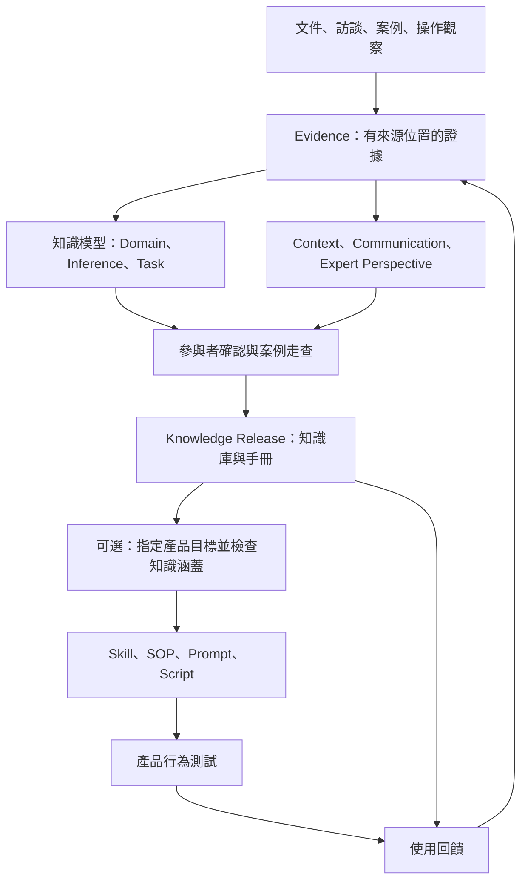

# 部門知識蒸餾工作坊

透過文件、訪談、案例與操作觀察，將部門的業務知識及資深員工的判斷經驗整理成可閱讀、可追溯、可再利用的知識庫；需要時，再從這份知識產生業務 Skill 或其他產品。

這是一個由 **Codex 帶領、使用者用自然語言參與**的 MVP。你不需要寫程式或手動填 YAML。你負責說明業務、提供材料、修正理解與確認案例；Codex 負責整理、建模、維護檔案及執行檢查。

目前具備六個核心 Skill、四個選用媒體 Skill、檔案型知識庫格式，以及本機驗證／發布工具。它還不是網站或自動運作的企業知識平台。

## 先看這裡：怎麼使用

在 Codex 開啟這個 repository，依手上的材料選一種起點。三種都使用 **`$bu-knowledge-workflow`**，最後都會建立同一格式的 Knowledge Release；差別是 Codex 第一輪先訪談、先讀文件，還是先核對流程圖。你不需要自己判斷文件內容是否足夠，照實說明手上有什麼即可。

| 起點 | 適合情境 | 建議先提供 | Codex 第一輪會做什麼 |
| --- | --- | --- | --- |
| **① 直接訪談** | 尚無文件／流程圖，或主要知識在資深員工腦中 | 部門或工作名稱、希望保留的經驗、可受訪的人 | 從工作目標與具體案例開始，畫任務草圖，再追問判斷線索、理由和例外 |
| **② 文件／範本起步** | 有作業手冊、政策、表單、空白範本、填寫範例等，但還沒有完整訪談成果 | 現有文件；空白範本若能搭配去識別的完成範例更好 | 先盤點版本、欄位、規則與缺口，再針對文件沒有說明的決策進行訪談 |
| **③ 訪談流程圖起步** | BA 或同事已訪談完，手上有流程圖、`.drawio`、訪談紀錄或會議筆記 | 流程圖及可取得的訪談原始資料／佐證 | 先解析節點、分支、角色與交接，回查訪談證據；只對缺少的判斷依據和例外追問 |

### ① 沒有材料：直接開始訪談

> 使用 $bu-knowledge-workflow。我目前沒有文件或流程圖，想整理「＿＿部門的＿＿工作」。請從訪談開始，先幫我界定範圍，接著用實際案例挖出資深員工怎麼判斷、何時例外。這次先產出知識庫。

如果重點是某位同事的經驗，可以把「＿＿部門的＿＿工作」換成「＿＿同事處理＿＿工作的經驗」。Codex 會保留這位專家的觀點與適用邊界，並把它連回部門任務。第一輪不會要求你先寫 PRD 或準備範本。

### ② 有文件或表單範本：先讀材料

> 使用 $bu-knowledge-workflow。我有「＿＿文件／空白範本／去識別的完成範例」，要整理「＿＿工作」的知識。請先盤點這些材料能證明的流程、欄位與規則，再列出需要訪談釐清的判斷與例外；這次先產出知識庫。

範本能顯示欄位與輸出形式，不能單獨證明每個欄位的來源、填寫規則或遇到例外時的處理方式。Codex 會標記哪些內容有文件根據、哪些仍需人說明。只有空白範本也可以開始；不必等到所有附件齊全。

### ③ 已有訪談後流程圖：先核對既有發現

> 使用 $bu-knowledge-workflow。這份是「＿＿工作」訪談後的流程圖，另有「＿＿訪談紀錄／筆記」（如有）。請先整理流程、角色、分支、交接與決策點，標出圖上看不到的判斷理由、例外和來源缺口，再只追問必要問題；這次先產出知識庫。

流程圖提供工作輪廓，訪談逐字稿或筆記可補上「為什麼這樣做」。如果只有流程圖，也能先建草稿，但圖中的箭頭不會自動變成已確認的業務規則；Codex 會指出需要哪一段訪談、文件或案例才能確認。`.drawio` 可使用 repo 內的解析工具，必要時再目視核對圖形關係。

三種材料可以混用。例如同時有表單和流程圖，直接把兩者一起提供；Codex 會先讀現成證據，再選最有價值的問題追問。`department-first` 和 `expert-first` 表示從部門任務或個人經驗切入，與上述三種材料起點可以自由搭配。

以上三段指令最後的「先產出知識庫」可以改為「知識庫完成後，也產出支援＿＿任務的 Skill」。Codex 會先檢查知識是否足夠，再建置與測試該 Skill；不會把範本或流程圖中的空白部分自行補成業務規則。

### 續作與後續產生 Skill

中斷後繼續：

> 請繼續 runs 裡這個 RUN 的工作，先讀 state.yaml，告訴我目前完成到哪裡。

產生 Skill 時：

> 請用這個 Knowledge Release，產生支援指定任務的業務 Skill。先檢查知識是否足夠，列出適用範圍和需要人工判斷的地方，再建置與測試。

環境中的 Skill 名稱相近時，請明確指定「使用這個 repository 的 `.agents/skills/bu-knowledge-workflow/SKILL.md`」。入口沿用舊版的明確呼叫設定，所以建議直接打 `$bu-knowledge-workflow`。

第一次使用可請 Codex「依 README 建立 Python 環境並執行 check-repo」。你不用自己操作下方的技術指令。

## 你會參與哪些步驟

| 階段 | Codex 會做什麼 | 你主要做什麼 | 看什麼成果 |
| --- | --- | --- | --- |
| 界定範圍 | 盤點流程、任務、專家與材料 | 說明目的，確認先處理哪個任務 | engagement 與 context 摘要 |
| 擷取證據 | 讀材料，進行 ACTA 訪談 | 提供具體事件、判斷理由與反例 | 訪談紀錄、來源與缺口 |
| 建立模型 | 整理概念、推理、任務、交接、專家視角 | 修正不符合業務的理解 | handbook 草稿 |
| 檢驗知識 | 核對來源，帶你走案例 | 確認這個版本，檢查預期結果 | coverage、案例與確認紀錄 |
| 發布知識 | 建立本機 Knowledge Release | 查看已知限制 | handbook、模型與版本索引 |
| 衍生產品（選用） | 建立 Skill/SOP 等，測試目標情境 | 指明產品用途，檢查產出 | artifact、追溯及測試結果 |

發布知識後即可結案。如果你先前已要求 Skill，流程會接著處理，不要求你重新回答已確認的問題。訪談和建模可以來回進行，不必等所有資料完整才看到成果。

## 方法論：為什麼這樣設計

### CommonKADS：整體骨架

CommonKADS 提供把專家知識建模的方式。本專案採輕量改編，保留「業務情境、知識模型、溝通交接、後續產品設計」的關係。

核心知識分成三層：Domain 說明業務概念與規則；Inference 說明如何由資訊形成判斷；Task 說明何時、按什麼順序使用這些判斷。如此才能同時保存「知道什麼」、「如何判斷」及「如何完成工作」。

例如只記「先檢查資料再決定」不夠。模型需要進一步保留：需要哪些資料、看什麼線索、為何支持某個結論、資料矛盾時如何處理、何時停止，以及下一個動作。

### ACTA：訪談資深員工的方法

Applied Cognitive Task Analysis 用來挖出通常不會寫進 SOP 的知識。Codex 先畫任務草圖，找出最需要經驗的地方，再從實際事件追問關鍵線索、替代方案、理由、新手錯誤及反例，整理成 cognitive demands table。

不是每項工作都要問完所有題目。訪談根據材料與知識缺口深入；假設情境與真實案例分開標示。詳細題目見 [ACTA 訪談設計](.agents/skills/elicit-business-knowledge/references/acta.md)。

### KCS：讓知識能重用與修正

採用工作中擷取、先搜尋已有知識、保存適用情境、使用後回饋的原則。新訪談會先比對既有知識 ID，判斷是補充、修正、不同適用情境或來源衝突。

### APQC 與 Distilly：輔助參考

APQC 的知識循環用於範圍盤點及回饋流程；Distilly 提供多來源蒸餾、保留專家方法及增量更新的參考。主架構採 CommonKADS；Expert Perspective 是本專案增加的模型，保留個人經驗並連到部門任務。

原始來源及具體取捨見 [架構與方法論說明](docs/architecture.md)。本專案不宣稱完整實作或通過上述方法論的認證。

## 整體架構



原始材料是來源，模型是整理後的知識，Release 是確認過範圍的版本，Skill 等是使用該版本的產品。Python 工具不會自動理解訪談或決定業務規則；這些由 Codex 與參與者一起完成。

### 資深員工的個人知識放哪裡？

同時支援 department-first 和 expert-first。專家的線索、心智模型、經驗法則、新手易錯處及限制存於 expert-perspectives，再連結相關 task/inference。

知識可以是 shared（有獨立來源支持並確認共同適用）、attributed（具名專家的方法）、contested（觀點衝突）。個人方法可用來產生明確標示該專家方法的 Skill，但不自動變成部門政策。

## 每個 Skill 的用途

| Skill | 責任 | 主要產出 |
| --- | --- | --- |
| [bu-knowledge-workflow](.agents/skills/bu-knowledge-workflow/SKILL.md) | 總入口、讀取進度、路由與續作 | state 與工作交接 |
| [frame-knowledge-engagement](.agents/skills/frame-knowledge-engagement/SKILL.md) | 定義目的、範圍、任務優先序與來源 | engagement、context 草稿 |
| [elicit-business-knowledge](.agents/skills/elicit-business-knowledge/SKILL.md) | 讀文件、ACTA 訪談、案例及觀察 | evidence、認知需求表、缺口 |
| [model-business-knowledge](.agents/skills/model-business-knowledge/SKILL.md) | 建立模型、去重、保留歸屬與衝突 | canonical YAML、handbook 草稿 |
| [validate-knowledge-release](.agents/skills/validate-knowledge-release/SKILL.md) | 核對、案例走查、確認及本機發布 | review、Knowledge Release |
| [build-knowledge-solution](.agents/skills/build-knowledge-solution/SKILL.md) | 檢查指定範圍，建產品並驗證 | target、artifact、traceability、測試 |

四個媒體 Skill 只在材料需要時使用，不是每次都要走的階段：

| Skill | 用途 | 限制 |
| --- | --- | --- |
| [prepare-audio-evidence](.agents/skills/prepare-audio-evidence/SKILL.md) | 轉錄或整理既有逐字稿、保存時間碼 | 口述不能證明畫面操作；不保證辨識 speaker |
| [extract-video-evidence](.agents/skills/extract-video-evidence/SKILL.md) | 長影片選段、畫格與時間軸 | 挑選範圍須覆蓋問題所需情境 |
| [analyze-video-evidence](.agents/skills/analyze-video-evidence/SKILL.md) | 從選取片段抽取操作與判斷證據 | 中間 JSON 需再映射到模型 |
| [record-bu-walkthrough](.agents/skills/record-bu-walkthrough/SKILL.md) | Windows 上錄製具口述的 walkthrough | 先取得畫面與麥克風同意；Game Bar 有視窗限制 |

文件／browser adapter 的使用方式在 [來源路由](.agents/skills/elicit-business-knowledge/references/adapters.md)。四個媒體 workers 保留獨立可發現目錄，沒有額外的 adapters 假 Skill。

## 每個資料夾的用途

```text
.agents/skills/    Codex 使用的技能指令和媒體工具
docs/             架構、資料格式、改造紀錄、驗證說明
schemas/          檢查 YAML 形狀的規格
scripts/          本機建立工作區、驗證、渲染、發布等工具
tests/            合成案例與錯誤情境的自動化測試
examples/         完全虛構的示範來源與可重現示範
runs/             每次實際蒸餾的工作區（執行時建立，Git 忽略）
knowledge/        部門知識庫與版本（目前只有說明）
solutions/        知識衍生產品（目前只有說明）
.venv/            本機 Python 依賴（Git 忽略）
```

Skill 裡的 `SKILL.md` 是行為指令；`agents/openai.yaml` 是顯示名稱與呼叫設定；`references/` 是按需讀取的詳細方法；`scripts/` 是可執行小工具。BU 使用者通常不需修改這些檔案。

### 一次工作：runs

| 路徑 | 用途 |
| --- | --- |
| state.yaml | 目前階段、下一步、待回答問題；供中斷續作 |
| engagement.yaml | 目標、參與者、範圍、來源及優先理由 |
| input/ | 原始材料或其明確引用，避免改寫來源 |
| evidence/ | 訪談、擷取、觀察、音訊與影片中間產物 |
| draft/ | 尚在整理的模型，使用 release 相同格式 |
| review/ | 確認原始紀錄、案例走查及修正紀錄 |

### 知識版本：knowledge

```text
knowledge/<department>/<domain>/
  index.yaml
  releases/<release-id>/
    manifest.yaml
    context.yaml
    domain.yaml
    inference.yaml
    task.yaml
    communication.yaml
    expert-perspectives.yaml
    cases.yaml
    evidence-index.yaml
    gaps.yaml
    review.yaml
    handbook.md
    coverage.md
    release-lock.yaml
```

最先看 **handbook.md**：它包含業務主張、理由、步驟、歸屬及來源。再看 **coverage.md**：哪些內容已確認、哪些仍有缺口。`manifest.yaml` 說明這版範圍；`gaps.yaml` 記未知和衝突；`review.yaml` 記誰確認了哪個版本及案例結果。

YAML 是主要知識來源，handbook 由它產生。不要只改 handbook；可以直接告訴 Codex：「這段判斷有問題，請修正知識模型並更新手冊。」

Release 是本機 snapshot。publish 拒絕覆蓋同 ID，hash 清單可偵測檔案變動；它不是安全簽章或自動 Git 版本。更正時產生新版本並記 base_release。原始來源若留在被 Git 忽略的 runs，其他人可能只能看到引用/摘錄，需另提供授權材料才能核對。

### 衍生產品：solutions

每個產品有 target.yaml（要做什麼）、artifact/（實際產品）、traceability.yaml（用到哪些知識）、validation.md（怎麼測、測到什麼及限制）。Generated Skill 不會自動安裝到個人環境或執行真實業務操作。

## Knowledge Release 何時足以產生 Skill？

先指定產品目標，工具沿任務的 refs 找出全部依賴，再檢查確認狀態、來源性質、專家歸屬、未知欄位及 blocking gap。

| 結果 | 意義 | 下一步 |
| --- | --- | --- |
| ready | 所選必要及選用任務的知識都可用 | 建產品，再驗證工具及行為 |
| limited-scope | 必要任務可用，部分選用任務不足 | 明列排除部分，建立有限範圍產品 |
| knowledge-gap | 任一必要任務缺知識 | 補訪談/資料或由使用者調整目標 |

Release 提供業務內容，Codex 還要做產品設計：觸發方式、使用者輸入、輸出格式、工具、人工停點與 reference 編排。此步驟不能新增未有依據的業務規則。

ready 只代表知識足夠。advisory Skill 可以協助判斷；execution Skill 若要操作系統，仍要有可用工具、權限及實際執行測試。詳見 [轉換契約](.agents/skills/build-knowledge-solution/references/solution-contract.md)。

## 如何判斷成果可信到什麼程度

- observed：來源可直接觀察此主張；仍需核對解讀。
- stated：參與者明確陳述；不代表有畫面證明。
- inferred：Codex 推論，仍待支持。
- conflicting：來源互相衝突。
- unresolved：資料不足。

確認另有 draft、participant-confirmed、scenario-tested。Release 最少需要參與者對目前版本的確認；重要判斷需至少一個案例走查。可以保留明列的非核心缺口，產品若依賴這些缺口則無法 ready。

**格式通過 ≠ 知識正確；知識確認 ≠ Skill 行為已測；案例通過 ≠ 所有情況都正確。** 你應要求 Codex 說清楚測試方法、expected、actual、來源及尚未測到的範圍。數量統計不等於部門涵蓋率。

## MVP 有什麼、還沒有什麼

已有：檔案型知識庫、六模型、ACTA 訪談指引、專家歸屬、來源/缺口、確認版本、案例紀錄、手冊、coverage、可選產品流程與檢查工具。

尚未加入：網站 UI、搜尋服務、向量資料庫、RAG API、正式審批、權限管理與定期維運治理。知識理解與 Skill 編寫由 Codex 執行，並非 Python 自動生成任意產品。真實部門效果待後續試點；本次只驗證合成案例及技術契約。

## 技術操作（交給 Codex 執行即可）

核心工具需要 Python 3.10+、PyYAML、jsonschema。從 repo 根目錄執行；macOS/Linux 將 `.venv/Scripts/python.exe` 換成 `.venv/bin/python`。

```powershell
python -m venv .venv
.venv/Scripts/python.exe -m pip install -r requirements.txt
.venv/Scripts/python.exe scripts/knowledge_workflow.py check-repo
.venv/Scripts/python.exe -m unittest discover -s tests -v
```

| 指令 | 用途 |
| --- | --- |
| init --department team --domain area --source-route guided-interview | 依材料起點建立空 run；不會填入或確認業務知識。可改用 document-first 或 map-first |
| validate <draft> | 檢查格式、ID、來源與依賴 |
| digest <draft> | 取得目前模型指紋 |
| render <draft> | 產生 handbook、coverage |
| validate <draft> --release | 再檢查目前版本確認及核心案例 |
| publish <draft> --library knowledge/team/area | 建新本機 snapshot 和索引 |
| coverage <release> <target.yaml> | 檢查指定產品的完整知識依賴 |
| verify-solution <release> <solution-dir> | 檢查產品追溯與測試紀錄契約 |
| check-repo | 檢查 Skill 結構、reference 連結及 schema |

退出碼：0 通過，1 格式/契約/檔案問題，coverage 的 2 表示 knowledge-gap。這些指令不會自動從一個 stage 跳到下一個，state 由 Codex 隨工作更新。

媒體能力選用安裝，核心文件/文字訪談不需要。影片工具通常需 ffmpeg/ffprobe、Pillow；本機轉錄另需 faster-whisper 及可用模型。詳細依各 worker reference；不在核心 requirements 強制安裝大型模型。本次沒有實際錄音錄影測試。

## 合成示範與驗證

見 [synthetic example](examples/synthetic/README.md)。它使用完全虛構的標籤卡片案例，示範 source → model → release → advisory Skill 的資料關係；確認及走查紀錄明確標成合成資料，不代表真人驗證。自動測試覆蓋來源遺失、未解推論、過期確認、依賴缺口、專家未選、發布覆蓋與快照變更等情境。

## 常見問題

**一定要先有完整文件嗎？** 不用。可以從資深員工的具體事件開始；缺口會被保留，逐步補足。

**文件和資深員工說法不一樣？** 保存各自來源與適用情境，列為 conflict。Codex 不自行替部門裁決。

**我可以只要知識庫嗎？** 可以，Release 的 handbook/index 已是成果。後續想做 Skill 再指定範圍即可。

**沒有全部回答，能不能產生初稿？** 可以。發布前確認範圍、核心知識與案例，其他缺口清楚標示。

**需要自己改 YAML 嗎？** 不需要。用自然語言要求修正；Codex 負責更新模型、引用、手冊及受影響測試。

**publish 會上 GitHub 嗎？** 不會。它只建立本機版本。runs 預設不進 Git；knowledge/solutions 可被追蹤，但 commit/push 前要確認內容適合 repo 的可見範圍。

**舊 Skill 去哪裡？** 舊的四個主流程 Skill 已由新分工取代；媒體程式保留並調整介面。移除內容仍可由 Git 基準版本找回，見 [改造紀錄](docs/migration.md)。

進一步閱讀：[架構與來源](docs/architecture.md) · [資料契約](docs/data-contract.md) · [流程狀態](.agents/skills/bu-knowledge-workflow/references/workflow.md) · [改造紀錄](docs/migration.md) · [本次驗證與限制](docs/validation.md)。
